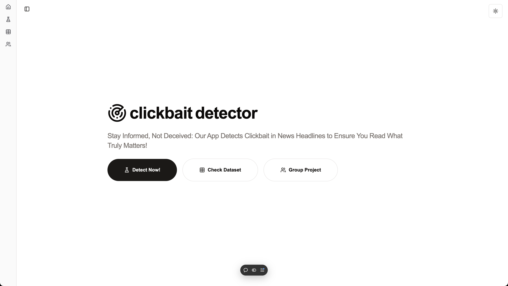

# Clickbait Detector - Frontend

This repository hosts the frontend for the Clickbait Detector application. Built using Next.js and styled with Shadcn UI components, it provides an intuitive interface for users to input news headlines and view clickbait predictions.




## Features

- Interactive user interface
- Real-time prediction results
- Modern design using Shadcn UI

## Requirements

- Node.js 18+
- npm or yarn

## Installation

1. Clone the repository:
   ```bash
   git clone https://github.com/gdapriana/clickbait-detector-frontend.git
   cd clickbait-detector-frontend
   ```
   
2.	Install dependencies:
   ```bash
  npm install
  # or
  yarn install
   ```

3. Start development server:
   ```bash
   npm run dev 
   # or
   yarn dev
   ```

## Usage
1. Enter a news headline in the input field. 
2. Click the `Chechk` button. 
3. The clickbait prediction percentage displayed on the screen.

Visit backend: https://github.com/gdapriana/clickbait-detector-backend